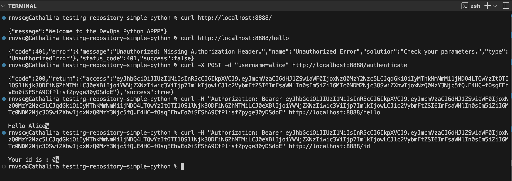
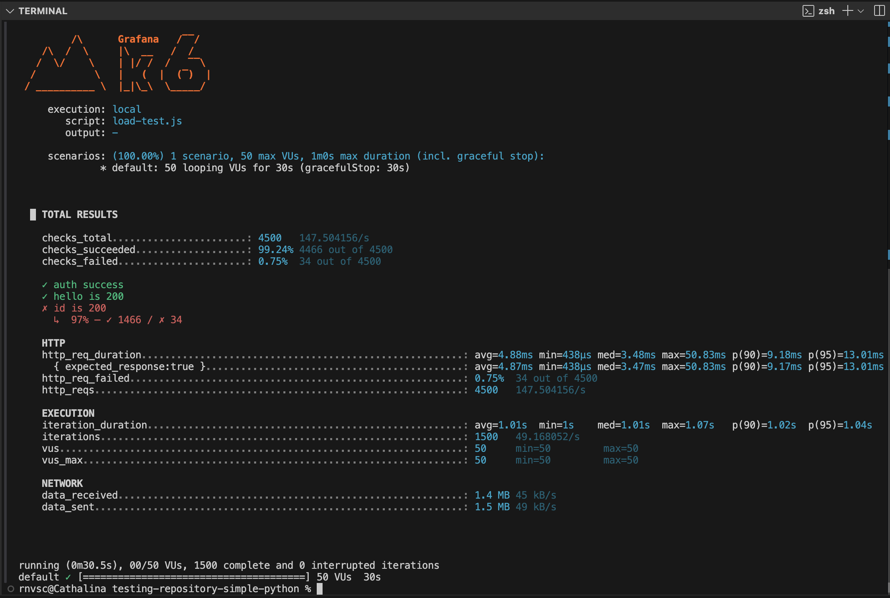
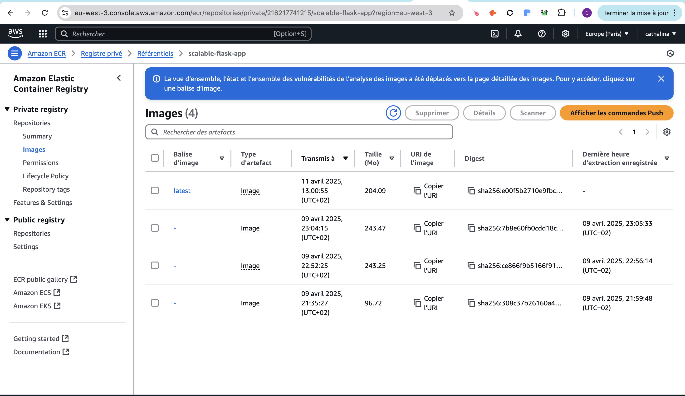
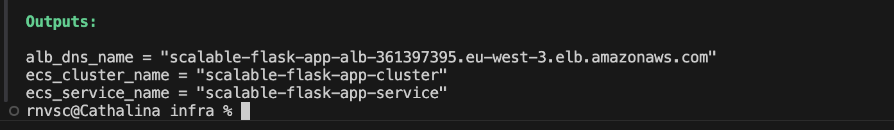
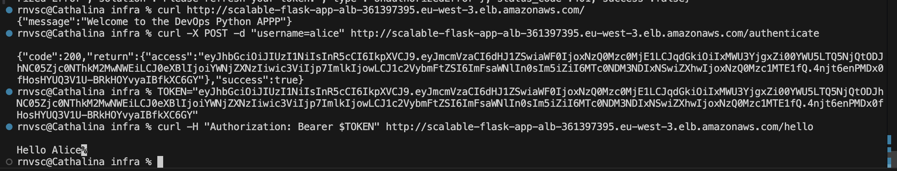
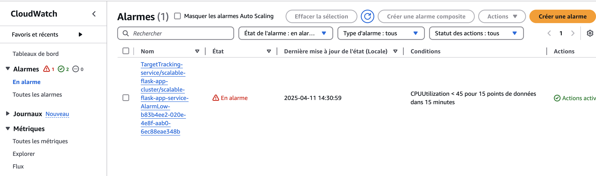
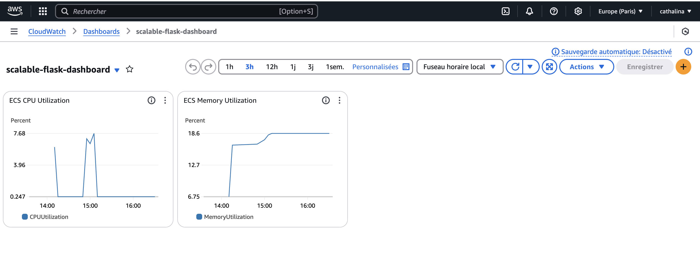
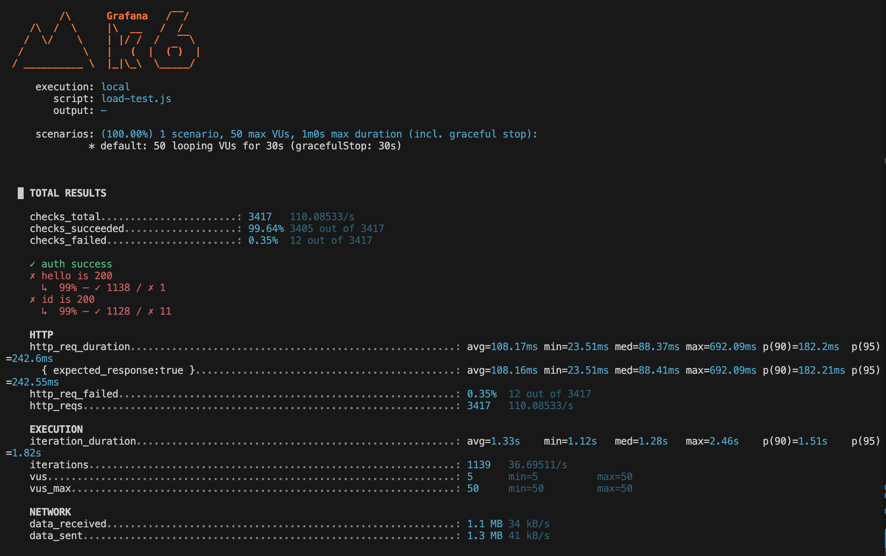

# Testing Repository

This repository is not for having a working job, it is actually only used to show basics in Python.

## Installation


Ensure you have installed dependencies.

```shell
python3.11 -m venv venv
source venv/bin/activate
pip install -r requirements.txt
```

### Local development

In local, and for better development experience, you need to install `requirements-dev.txt`.

Then to install pre-commit config

```shell
pre-commit install
```

## How to run

Ensure you have installed dependencies.

```shell
python3.11 -m venv venv
source venv/bin/activate
pip install -r requirements.txt
```

> In local, and for better development experience, you need to install `requirements-dev.txt`.

Then launch the python application.

```shell
python app.py
```
--------------------------------------------------------------------------------------------------------------------
--------------------------------------------------------------------------------------------------------------------

# Projet Python Flask - Préparation Production & Scalabilité AWS

## Contexte

Application Flask développée par un développeur back-end junior.

Besoin métier : rendre l'application exploitable en production et capable de gérer une montée en charge sur un environnement AWS.

---

## Stack Technique

| Composant | Usage |
|-----------|-------|
| Python 3.11 | Langage principal |
| Flask | Framework API |
| Flask-JWT-Extended | Gestion des tokens JWT |
| Gunicorn | Serveur WSGI pour la production |
| Docker | Conteneurisation de l'application |
| AWS ECS Fargate | Hébergement scalable des conteneurs |
| AWS ALB (Load Balancer) | Distribution du trafic réseau |
| AWS CloudWatch | Centralisation des logs et monitoring |
| k6 | Tests de montée en charge |

---

## Problèmes initiaux constatés

| Problème | Impact |
|----------|--------|
| Lancement via `python app.py` | Pas de multi-process, non scalable |
| Stockage des users dans `data.json` | Risque de perte de données, non thread-safe, impossible avec plusieurs instances |
| Absence d'architecture cloud | Aucun déploiement AWS prévu |
| Pas de CI/CD | Déploiement manuel |
| Logs non centralisés | Difficile à monitorer |
| Pas de tests de charge | Impossible d'évaluer le comportement sous charge |

---

## Actions DevOps réalisées pour la mise en production

### 1. Dockerisation production
J'ai utilisé Gunicorn pour fournir un serveur WSGI robuste et scalable pour la production. L'application est désormais conteneurisée avec Docker.

```dockerfile
CMD ["gunicorn", "-b", "0.0.0.0:8888", "src:application", "-w", "4", "--threads", "2"]
```
docker build -t scalable-python-app .
docker run --rm -p 8888:8888 --env-file .env scalable-python-app



k6 run loadtest.js



Les tests de charge k6 montrent que l'application supporte bien un trafic de 50 utilisateurs simultanés, avec des temps de réponse excellents (avg 4.8ms). Les seules erreurs détectées viennent des accès concurrents au fichier data.json, ce qui confirme la nécessité de migrer le stockage des utilisateurs vers une base de données (DynamoDB ou RDS) pour garantir la stabilité en production.


## 2. Build + Push de l'image scalable-python-app sur AWS ECR
L'image Docker a été construite et poussée vers AWS ECR pour être déployée via ECS Fargate.
docker buildx create --use
docker buildx build --platform linux/amd64 -t scalable-python-app . --load

 Tag  image Docker
 docker tag scalable-python-app:latest 218217741215.dkr.ecr.eu-west-3.amazonaws.com/scalable-flask-app:latest

 Push l'image dans ECR
docker push 218217741215.dkr.ecr.eu-west-3.amazonaws.com/scalable-flask-app:latest



### 3. Infrastructure AWS cible

- AWS ECS Fargate
- AWS Application Load Balancer (ALB)
- AWS CloudWatch Logs


Mon Terraform déploie toute l'infrastructure nécessaire pour exécuter une API Flask scalée automatiquement sur AWS ECS Fargate, derrière un Load Balancer, avec des logs centralisés dans CloudWatch et un système d'auto-scaling basé sur l'utilisation CPU. 
Mon Terraform déploie une infrastructure AWS entièrement serverless et scalable, basée sur ECS Fargate, derrière un Load Balancer public (ALB), avec les logs centralisés dans CloudWatch. La partie persistence des utilisateurs est locale (data.json), mais pourrait facilement évoluer vers DynamoDB ou RDS si le besoin apparaissait.

terraform init
terraform plan
terraform apply
terraform output




http://scalable-flask-app-alb-361397395.eu-west-3.elb.amazonaws.com/
---

### 4. Gestion du CPU et Auto-Scaling ECS
Afin de rendre l'application scalable et capable de supporter des pics de charge, des alarme CloudWatch et des politiques d'auto-scaling ont été mises en place.

Alarme CloudWatch pour l'usage du CPU ECS
Une alarme CloudWatch a été configurée pour surveiller l'utilisation du CPU du service ECS. L'alarme se déclenche si l'utilisation moyenne du CPU dépasse 80% pendant 2 périodes consécutives de 60 secondes.

Cible d'Auto-Scaling ECS (si l'utilisation du CPU dépasse 50%)
Une cible d'auto-scaling a été définie pour permettre à notre service ECS de s'ajuster en fonction de la charge CPU. Si l'utilisation du CPU dépasse 50%, le nombre de tâches ECS peut augmenter de manière automatique pour gérer la montée en charge.

Politique d'Auto-Scaling basée sur l'utilisation du CPU
Une politique d'auto-scaling a été définie pour que l'application maintienne une utilisation moyenne du CPU à 50%. Cela permet d'ajuster dynamiquement le nombre de tâches ECS en fonction de la charge CPU.



---

### 5. Tests de charge avec k6
- Tests de montée en charge automatisés via k6 pour vérifier le comportement de l'API sous plusieurs milliers de requêtes simultanées.
k6 run load-test.js



---

### 6. Déploiement CI/CD 

- Un pipeline complet de CI/CD a été mis en place via GitHub Actions. Ce pipeline s'occupe de :
    - Lint
    - Tests unitaires
    - Build image Docker
    - Push vers AWS ECR
    - Déploiement automatique vers ECS Fargate

    

---

## Architecture AWS cible

```
Client
  ↓
AWS ALB
  ↓
ECS Fargate (Docker + Gunicorn)
  ↓
CloudWatch Logs
```

---

## Roadmap (Actions futures)

| Amélioration | Intérêt |
|--------------|---------|
| Migration de `data.json` vers AWS DynamoDB/RDS | Persistance, sécurité, montée en charge |
| Mise en place complète CI/CD | Déploiement rapide et fiable |
| Intégration monitoring avancé | Sentry, Datadog, AWS Alarms |
| Tests de charge k6 automatisés dans CI | Validation continue des performances |


## Conclusion

L'application est désormais prête pour être exploitée de manière fiable en production AWS, avec une architecture évolutive, sécurisée et monitorée.

## 👤 Auteur

**Cathalina RANAIVOARISON**  
